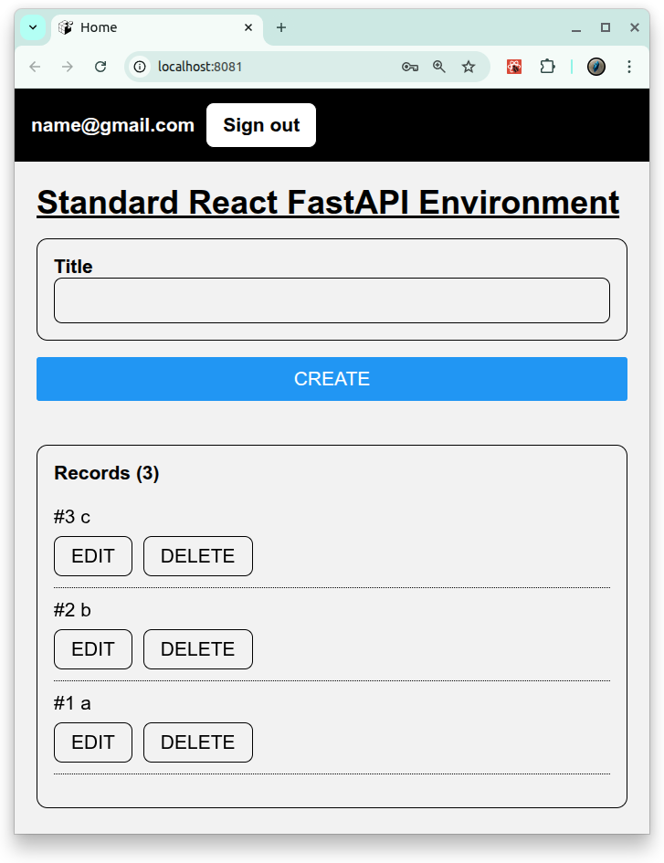
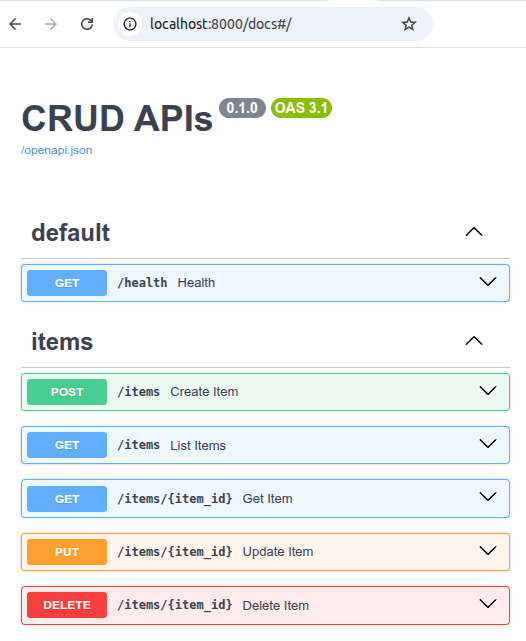
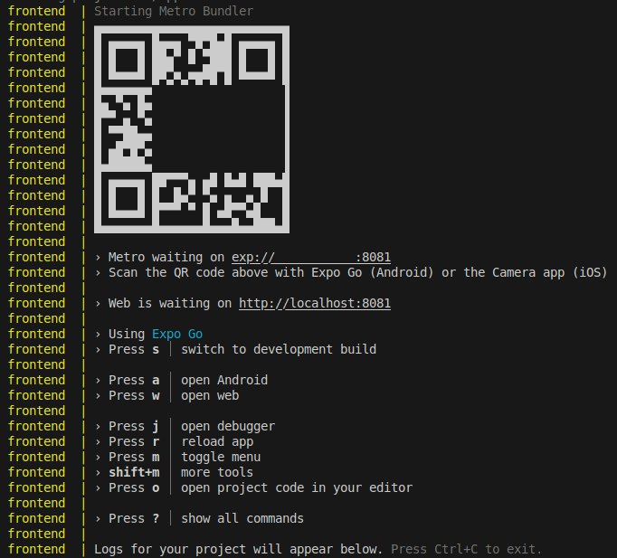

# [Standard React FastAPI Environment](https://github.com/europanite/standard_react_fastapi_environment "Standard React FastAPI Environment")

[](https://opensource.org/licenses/Apache-2.0)

[](https://www.python.org/)
[](https://github.com/europanite/standard_react_fastapi_environment/actions/workflows/ci.yml)
[](https://github.com/europanite/standard_react_fastapi_environment/actions/workflows/lint.yml)
[](https://github.com/europanite/standard_react_fastapi_environment/actions/workflows/pages/pages-build-deployment)
[](https://github.com/europanite/standard_react_fastapi_environment/actions/workflows/codeql.yml)


<p align="right">
  <a href="./README.md">🇺🇸 English</a> |
  <a href="./README.hi.md">🇮🇳 हिंदी</a> |
  <a href="./README.ja.md">🇯🇵 日本語</a> |
  <a href="./README.zh-CN.md">🇨🇳 简体中文</a> |
  <a href="./README.es.md">🇪🇸 Español</a> |
  <a href="./README.pt-BR.md">🇧🇷 Português (Brasil)</a> |
  <a href="./README.ko.md">🇰🇷 한국어</a> |
  <a href="./README.de.md">🇩🇪 Deutsch</a> |
  <a href="./README.fr.md">🇫🇷 Français</a>
</p>


次の技術を使用した **フルスタック開発環境** です。

- **Frontend**: [Expo](https://expo.dev/)（[React Native](https://reactnative.dev/) + [TypeScript](https://www.typescriptlang.org/)）  
  - 単一の codebase で **Web、Android、iOS** に対応
- **Backend**: [FastAPI](https://fastapi.tiangolo.com/)（Python）  
- **Database**: [PostgreSQL](https://www.postgresql.org/)
- **Container**: 一貫した開発環境を構築するための [Docker Compose](https://docs.docker.com/compose/)

---

## Features

- Expo による **クロスプラットフォーム frontend**  
  - **web app** として実行でき、Expo Go または standalone builds を使って **Android/iOS devices** でも動作
- **CRUD operations** : records の作成、読み取り、更新、削除
- **Auth operations** : Signup、Signin、Signout
- automatic docs を備えた **FastAPI backend**
  - Swagger UI (/docs) による REST API

---

## 🚀 Getting Started

### 1. Prerequisites
- [Docker Compose](https://docs.docker.com/compose/)
- [Expo Go](https://expo.dev/go)（Android/iOS testing 用）

### 2. すべての services を build して start する:

```bash
# set environment variables:
export REACT_NATIVE_PACKAGER_HOSTNAME=${YOUR_HOST}

# Build the image
docker compose build

# Run the container
docker compose up
```

---

### 3. Test:

```bash
# Backend pytest
docker compose \
  -f docker-compose.test.yml run \
  --rm \
  --entrypoint /bin/sh backend_test \
  -lc ' pytest -q '

# Backend Lint
docker compose \
  -f docker-compose.test.yml run \
  --rm \
  --entrypoint /bin/sh backend_test \
  -lc 'ruff check /app /tests'

# Frontend Test
docker compose \
  -f docker-compose.test.yml run \
  --rm frontend_test
```

---

### 4. services にアクセスする:

- Backend API: http://localhost:8000/docs


- Frontend UI (WEB): http://localhost:8081
- Frontend UI (mobile): exp://${YOUR_HOST}:8081: Expo が表示する QR からアクセスします。


---

# License
- Apache License 2.0
