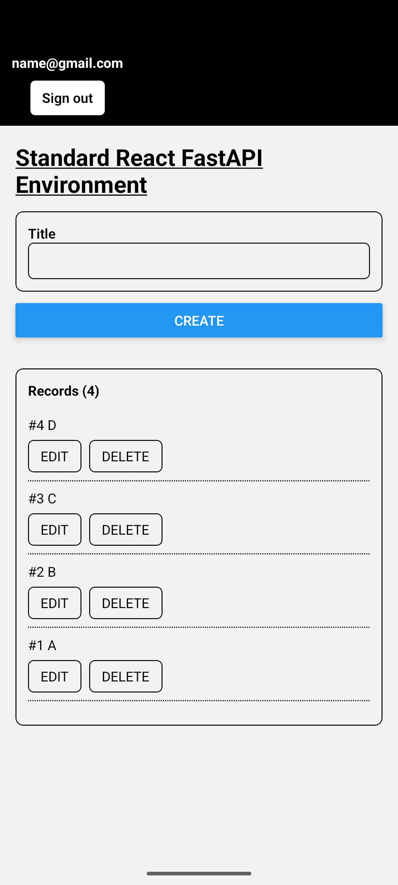
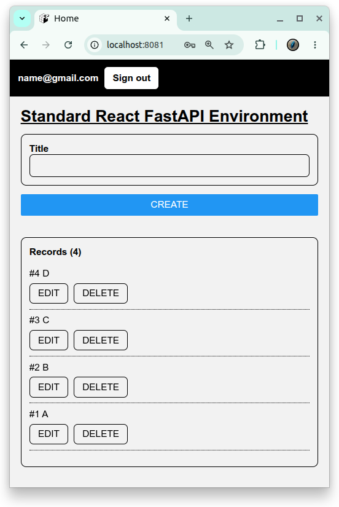
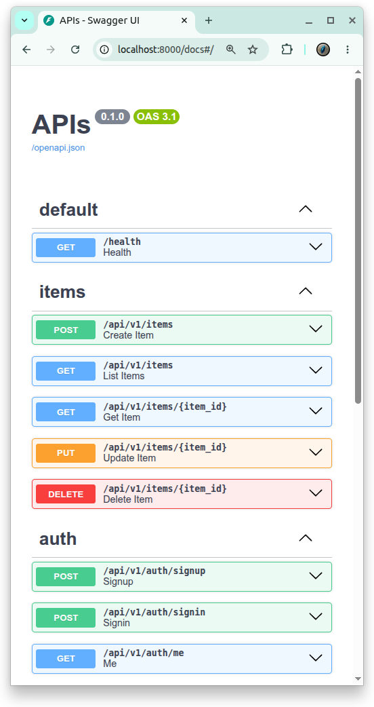
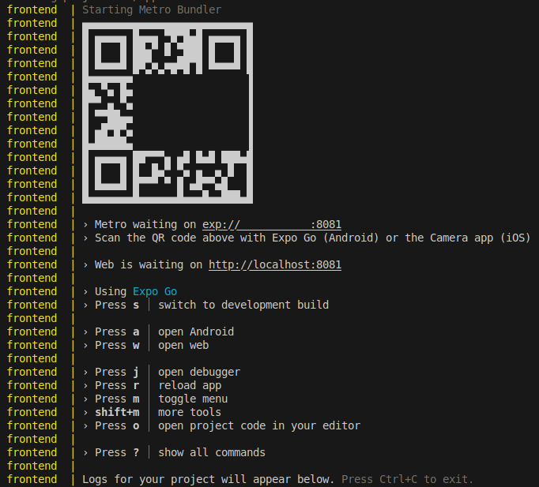

# [Standard React FastAPI Environment](https://github.com/europanite/standard_react_fastapi_environment "Expo React Native + FastAPI Backend Starter")

[](https://opensource.org/licenses/Apache-2.0)

[](https://www.python.org/)

[](https://github.com/europanite/standard_react_fastapi_environment/actions/workflows/ci.yml)
[](https://github.com/europanite/standard_react_fastapi_environment/actions/workflows/lint.yml)
[](https://github.com/europanite/standard_react_fastapi_environment/actions/workflows/pages/pages-build-deployment)
[](https://github.com/europanite/standard_react_fastapi_environment/actions/workflows/codeql.yml)


<p align="right">
  <a href="https://europanite.github.io/standard_react_fastapi_environment/">🇺🇸 English</a> |
  <a href="https://europanite.github.io/standard_react_fastapi_environment/hi/">🇮🇳 हिंदी</a> |
  <a href="https://europanite.github.io/standard_react_fastapi_environment/ja/">🇯🇵 日本語</a> |
  <a href="https://europanite.github.io/standard_react_fastapi_environment/zh-CN/">🇨🇳 简体中文</a> |
  <a href="https://europanite.github.io/standard_react_fastapi_environment/es/">🇪🇸 Español</a> |
  <a href="https://europanite.github.io/standard_react_fastapi_environment/pt-BR/">🇧🇷 Português (Brasil)</a> |
  <a href="https://europanite.github.io/standard_react_fastapi_environment/ko/">🇰🇷 한국어</a> |
  <a href="https://europanite.github.io/standard_react_fastapi_environment/de/">🇩🇪 Deutsch</a> |
  <a href="https://europanite.github.io/standard_react_fastapi_environment/fr/">🇫🇷 Français</a>
</p>

> これは `README.md` の翻訳版である。正本は英語版である。





Expo React Native アプリを FastAPI backend に接続するための、すぐに実行できる full-stack starter container。

この template には、Expo React Native frontend、FastAPI backend、PostgreSQL、JWT authentication、CRUD APIs、Docker Compose、backend tests、frontend tests、GitHub Actions CI が含まれる。

Expo で mobile app または web app を構築し、FastAPI backend に接続したい場合に、この repository を使用する。

**full-stack development environment** の構成:

- **Frontend**: [Expo](https://expo.dev/) ([React Native](https://reactnative.dev/) + [TypeScript](https://www.typescriptlang.org/))  
  - 単一の codebase で **Web、Android、iOS** に対応
- **Backend**: [FastAPI](https://fastapi.tiangolo.com/) (Python)  
- **Database**: [PostgreSQL](https://www.postgresql.org/)
- **Container**: 一貫した development setup のための [Docker Compose](https://docs.docker.com/compose/)

---

## Features

- Expo による **Cross-platform frontend**  
  - Expo Go または standalone builds を通じて、**web app** として、または **Android/iOS devices** 上で実行可能
- **CRUD operations** : records の Create、Read、Update、Delete
- **Auth operations** : Signup、Signin、Signout
- automatic docs 付きの **FastAPI backend**
  - `/api/v1` 配下の versioned REST API と Swagger UI (`/docs`)

---

## 🚀 Getting Started

### 1. Prerequisites
- [Docker Compose](https://docs.docker.com/compose/)
- [Expo Go](https://expo.dev/go) (Android/iOS testing 用)

### 2. すべての services を build して start する:
```bash
# set environment variables:
export REACT_NATIVE_PACKAGER_HOSTNAME=${YOUR_HOST}

# Build the image
docker compose build

# Run the container
docker compose up
```
---

### 3. Test:

```bash
# Backend pytest
docker compose \
  -f docker-compose.test.yml run \
  --rm \
  --entrypoint /bin/sh backend_test \
  -lc ' pytest -q '

# Backend Lint
docker compose \
  -f docker-compose.test.yml run \
  --rm \
  --entrypoint /bin/sh backend_test \
  -lc 'ruff check /app /tests'

# Frontend Test
docker compose \
  -f docker-compose.test.yml run \
  --rm frontend_test
```

---

### 4. Services にアクセスする:

- Backend API: http://localhost:8000/docs


- Frontend UI (WEB): http://localhost:8081
- Frontend UI (mobile): exp://${YOUR_HOST}:8081: Expo が提供する QR から access する。


---

# License
- Apache License 2.0