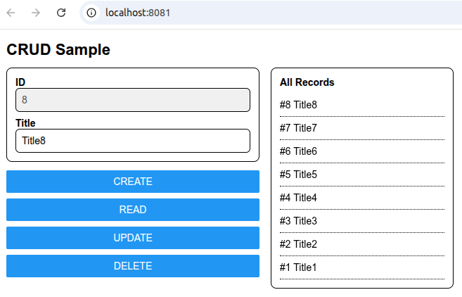

# [Standard React Fastapi Environment](https://github.com/europanite/standard_react_fastapi_environment "Standard React Fastapi Environment")



**full-stack development environment** using:

- **Frontend**: [Expo](https://expo.dev/) (React Native + TypeScript)  
  - Runs on **Web, Android, and iOS** with a single codebase
- **Backend**: [FastAPI](https://fastapi.tiangolo.com/) (Python)  
- **Database**: PostgreSQL  
- **Container**: Docker Compose for consistent development setup

---

## Features

- **Cross-platform frontend** with Expo  
  - Runs as a **web app** or on **Android/iOS devices** via Expo Go or standalone builds
- **CRUD operations** : Create, Read, Update, Delete records
- **FastAPI backend** with automatic docs at [/docs](http://localhost:8000/docs)  
  - REST API with Swagger UI (/docs)

---

## 📦 Services

- **backend**: FastAPI + SQLAlchemy  
  - Port: `8000`  
  - API Docs: [http://localhost:8000/docs](http://localhost:8000/docs)

- **frontend**: React Native (Expo Web)  
  - Port: `8081`  
  - Web UI: [http://localhost:8081](http://localhost:8081)

- **db**: PostgreSQL  
  - Port: `5432`  
  - Data is persisted in `./db_data`

---

## 🚀 Getting Started

### 1. Prerequisites
- Docker & Docker Compose
- Expo Go app (for Android/iOS testing)

### 2. Environment
- set REACT_NATIVE_PACKAGER_HOSTNAME in the .env file:

### 2. Build and start all services:

```bash
# First-time build
docker compose up --build

# Subsequent runs
docker compose up
```

### 3. Visit the services:

- Backend API: http://localhost:8000/docs


- Frontend UI (WEB): http://localhost:8081
- Frontend UI (mobile): exp://${HOST}:8081: access it with the QR.


---
# License
- Apache License 2.0