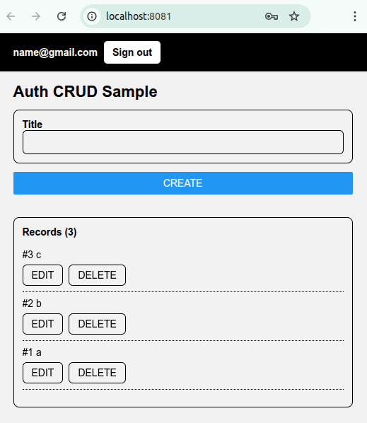

# [Standard React FastAPI Environment](https://github.com/europanite/standard_react_fastapi_environment "Standard React FastAPI Environment")

[](https://github.com/europanite/standard_react_fastapi_environment/actions/workflows/ci.yml)
[](https://github.com/europanite/standard_react_fastapi_environment/actions/workflows/lint.yml)
[](https://github.com/europanite/standard_react_fastapi_environment/actions/workflows/pages/pages-build-deployment)
[](https://github.com/europanite/standard_react_fastapi_environment/actions/workflows/codeql.yml)



**full-stack development environment** using:

- **Frontend**: [Expo](https://expo.dev/) ([React Native](https://reactnative.dev/) + [TypeScript](https://www.typescriptlang.org/))  
  - Runs on **Web, Android, and iOS** with a single codebase
- **Backend**: [FastAPI](https://fastapi.tiangolo.com/) (Python)  
- **Database**: [PostgreSQL](https://www.postgresql.org/)
- **Container**: [Docker Compose](https://docs.docker.com/compose/) for consistent development setup

---

## Features

- **Cross-platform frontend** with Expo  
  - Runs as a **web app** or on **Android/iOS devices** via Expo Go or standalone builds
- **CRUD operations** : Create, Read, Update, Delete records
- **Auth operations** : Signup, Signin, Signout
- **FastAPI backend** with automatic docs
  - REST API with Swagger UI (/docs)

---

## 🚀 Getting Started

### 1. Prerequisites
- [Docker Compose](https://docs.docker.com/compose/)
- [Expo Go](https://expo.dev/go) (for Android/iOS testing)

### 2. Build and start all services:

```bash
# set environment variables:
export REACT_NATIVE_PACKAGER_HOSTNAME=${YOUR_HOST}

# Build the image
docker compose build

# Run the container
docker compose up
```

---

### 3. Test:

```bash
# Backend Test
docker compose \
  -f docker-compose.test.yml run \
  --rm \
  --entrypoint /bin/sh backend_test \
  -lc ' pytest -q '

# Frontend Test
docker compose \
  -f docker-compose.test.yml run \
  --rm frontend_test
```

---

### 4. Visit the services:

- Backend API: http://localhost:8000/docs


- Frontend UI (WEB): http://localhost:8081
- Frontend UI (mobile): exp://${YOUR_HOST}:8081: access it with the QR provided by Expo.


---

# License
- Apache License 2.0